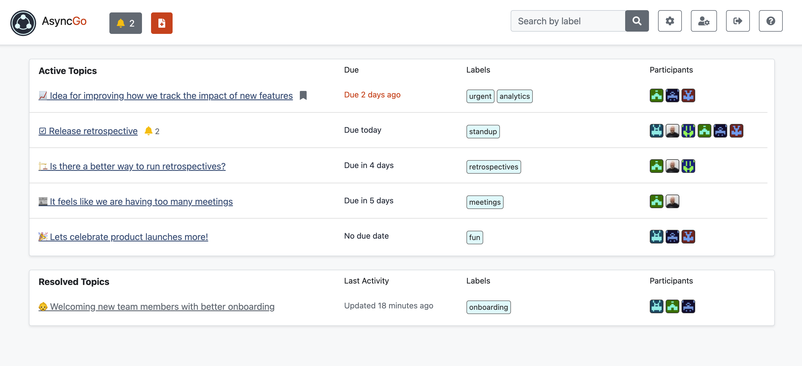
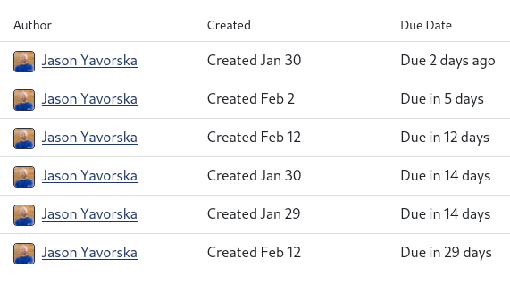
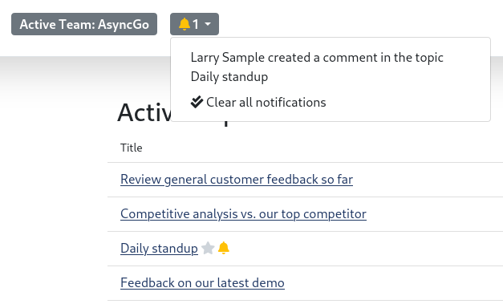

[Docs Home](index.md) | [Integrations](integrations.md) | [Markdown](markdown.md) | [Teams](teams.md) | [Topics](topics.md) | [User Settings](usersettings.md)

# AsyncGo Basics

Welcome! AsyncGo is a collaboration tool meant to help reduce the number of
meetings and chat interruptions your team is experiencing, and to help improve
the flow around conversations and decisions you're having about how you work. It
doesn't replace Zoom, Slack, Jira, or Google Docs, and so doesn't require you to
go through yet another tools migration, but it provides a better place for
conversations to happen to bring all of these together.

## What is Async

Async is a style of working where, instead of scheduling or expecting real-time
response, you collaborate via a shared document and question and response cycles
aren't expected to be immediate.

It brings a number of benefits:

- Working async means you need fewer meetings and less real-time chat
- People who like to think before responding or who don't feel comfortable
  speaking up in a group are also included
- Anyone who has family commitments or other scheduling challenges can still
  participate
- Team members who are on the road don't miss anything
- The time you spend in real-time meetings can be used for human connection
  instead of working on a document together, or watching someone read a
  presentation

It's also important to realize that async is not limited to remote teams - even
teams that are colocated and work together in an office can benefit from fewer
meetings and more focus time.

### Kinds of collaboration that can be done async

Remote work expert
[Tammy Bjellend](https://twitter.com/TammyBjelland/status/1368944178235904000)
describes the kinds of communication that can be done async in this
[tweet](https://twitter.com/TammyBjelland/status/1368944178235904000), in order
from easiest to hardest:

1. Informing: Sharing information and updates
1. Collaboration: Completing a predetermined task
1. Creativity: Generating new ideas
1. Decision making: Influencing, gaining consensus, and taking action
1. Innovation: Turning a new concept into reality
1. Connecting: Building social capital and deepening relationships

She goes on to say, "When we talk about async in remote, it's not about ONLY
async ALL the time. It's about striking a better balance between sync/async to
allow team members and teams to manage their time, attention, energy. Remote and
hybrid teams looking to improve that async/sync balance generally start with the
lower order communication purposes. Unfortunately, many stop at #2, and continue
to rely on office-based practices for decision making, connections, and
innovating."

A lot of teams are doing 1 or 2, but growing into 3 or 4 is difficult. That's
exactly what AsyncGo is here to help you with.

### Resources

Here are some other great resources to learn more about async work:

- [What is Async? Understanding How to Collaborate Remotely and Solve Zoom Fatigue](https://www.hrexchangenetwork.com/employee-engagement/columns/what-is-async-understanding-how-to-collaborate-remotely-and-solve-zoom-fatigue)
- [GitLab's Async Work Handbook](https://about.gitlab.com/company/culture/all-remote/asynchronous/)

## Key Concepts

There are a few key concepts to be familiar with when using AsyncGo:

### Timeboxing

We recommend setting a due date on nearly every item. Setting a due date helps
your team members know when they need to reply by. Most users work down the
topic list from the ones coming due most soon to the furthest out, in order to
make sure they have a chance to contribute to the topics they are interested in.

This lets everyone manage their own time to decide what they want to focus on at
any given point, while having the confidence that they won't miss out.

Note that due dates are at the end of the chosen day. If you want something to
be due at end of day Monday, then you should choose Monday as the date. If,
instead, you want it to be due at midnight on Sunday, you should choose Sunday
instead.

### Clear Communication

Because you aren't meeting as a team and kicking things off with a general Q&A
session, at least via the app, it's important to write a very clear description
that sets the table for the problem at hand. Include links to relevant
documentation, sources, and issues, and in general try to not assume any context
from the reader. This will also help you later when the topic is reviewed to see
how a decision was made.

You can also apply some initial structure to the outcome, indicating the format
of what you're looking for in the end. That can also help focus the team and
ensure they understand what you are asking for.

If you are the kind of person who likes to lay things out with spoken words, you
can always record audio or video and [embed it](#video) into the description,
outcome, or a comment. Note that embedded videos are not auto-transcribed, so
are not searchable.

### Slower-Paced Notifications

The primary way to be notified about what's going on in AsyncGo is via digest
notifications. These are meant to be reviewed a couple of times per day, at your
convenience, and highlight what's new since your last visit, as well as any
items that are coming due soon.

In this way you aren't constantly being interrupted to respond to the latest
reply in a conversation thread, like you might be in a regular chat application.
Also, since your collaborators aren't expecting immediate replies, it helps
everyone be in the right mindset.

This may feel like you're slowing down overall, but it just isn't the case. By
working on several topics simultaneously, rather than serially as you would in
meetings, you actually get more done. While it's true that any individual item
may take slightly longer, the overall productivity is much higher. In any case,
if something is urgent and needed right away, it's always possible to reach out
to the person directly.. but this should be saved for real urgent situations,
because whenever you do this you're impacting the team's async flow.

## Keyboard shorcuts

AsyncGo comes with several keyboard shortcuts to make it easy to use.

### From anywhere

- Press `h` to return to the topic index

### Topic index page

- You can open the first 9 topics by pressing the `1-9` keys

### Topic page

- Press `w` to toggle watching the topic
- Press `p` to toggle the pinned status
- Press `e` to start editing
- Press `r` to resolve or unresolve the topic
