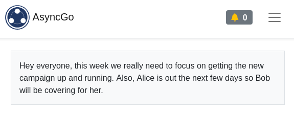

[Docs Home](index.md) | [Integrations](integrations.md) | [Markdown](markdown.md) | [Teams](teams.md) | [Topics](topics.md) | [User Settings](usersettings.md)

# Teams

Teams in AsyncGo represent one group of users who collaborate with each other.

## Managing Teams

From the Teams page you are able to add and remove users. A few important notes:

- Users must be individually invited from the Teams page
- There are no limitations on domain name as to who can be invited to the team
- An individual user, as defined by one email address, may only be a member of
  one team

## Setting a Team message

It's possible to set a team message that will be shown from the main topic list
page. The team message is intended to show a daily or weekly update for the
team, such as the priorities for that week, holidays, different people being
unavailable, or other updates that might impact how the team interacts with the
open topics in a general sense.

