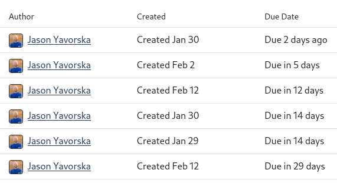

[Docs Home](index.md) | [Integrations](integrations.md) | [Markdown](markdown.md) | [Teams](teams.md) | [Topics](topics.md) | [User Settings](usersettings.md)

# Topics

AsyncGo is oriented around temporary **topics** that are created, typically from
a pre-existing meeting or issue, that can represent any discussion topic that
needs to be had. A topic is meant to exist for a short period of time during
which everyone contributes their thoughts.

At the end the discussion is resolved and the final outcomes and/or decisions
are recorded.

## The Topic List

When you log in you'll see a list of open topics. From here you can click on any
of the available topics to participate. The topic list shows the name of the
topic, the date it was created, the due date, and the list of participants. The
creator of the topic is the first person listed in the participant list.

If you have any notifications in a topic, you will see a gold notification bell
along with the number of updates in that topic since you last visited it.

## Creating Topics

From the topic list click on "New Topic" to create a topic. You will be prompted
to enter a description and a title. Topic descriptions set the table for the
conversation to be had and are very important. You can use
[markdown](markdown.md) to enter richer content than plain text; we
recommend including a checklist of key points to discuss, which can be marked
off as you go, and potentially an embedded video recording to help set the
context.

## Due Dates

Topics can also have a due date set, which will be made visible to everyone
looking at the topic index. This can be a great way to communicate when you need
something by, and help everyone prioritize the topics they engage with.

## Labels

You can add labels to a topic when editing them. For now, this is a list of
space-separated labels that show up when viewing a topic. It is also possible to
filter topics from the topic index page; this is also a space-separated list.

## Pinning

You can also pin a topic if you want it to remain at the top of the list. This
can be used when you want to keep a topic visible, either because it's important
to collaborate on, or because it's frequently referenced and you want to ensure
you don't lose track.

Active and resolved topics can be pinned separately.

## Collaborating on Topics

Once the topic is set up you can share it with everyone who you want to
participate. Everyone can collaborate async as you go, discussing the topic at
hand until you reach your outcome.

If you are replying to a specific comment, you can click the quote button to
easily include the content of the comment you're referring to in your reply.

## Voting in Topics

You can vote on any comment inside of a topic by adding thumbs up and thumbs
down emojis. These can be used to indicate approval or disapproval. One bit of
advice - if you disapprove, follow up on your emoji with another comment to
explain why.

You can hover over the emoji to see the list of people who have voted.

## Resolving Topics

Now that your topic is complete you can mark it as resolved. A good idea for
confirming everyone is onboard with the final outcome is to add a comment asking
everyone if they are ready to finalize the outcome. They can then add thumbs up
emojis to indicate their active support.
