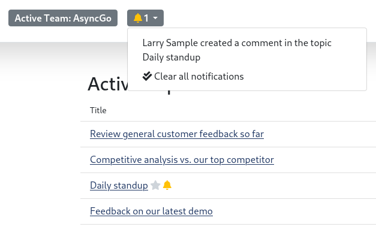
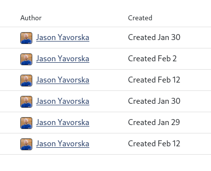

# User Settings

AsyncGo is oriented around temporary **topics** that are created, typically from
a pre-existing meeting or issue, that can represent any discussion topic that
needs to be had. A topic is meant to exist for a short period of time during
which everyone contributes their thoughts.

At the end the discussion is resolved and the final outcomes and/or decisions
are recorded.



## Notifications

If you are watching any topics then notifications will start to appear in your
notifications list whenever someone updates or comments in a topic you are
watching.

Click on the notification bell at the top of any page and you can view all the
open notifications you have. From here you can also clear all notifications.

You can watch any topic from the view topic page, by clicking on the button to
start watching.

{:.img-fluid.w-50.border.border-secondary.glightbox}

## Avatar

AsyncGo shows your avatar from [Gravatar](https://www.gravatar.com). You can
update your picture there, and it will automatically be reflected here.

{:.img-fluid.w-50.border.border-secondary.glightbox}
