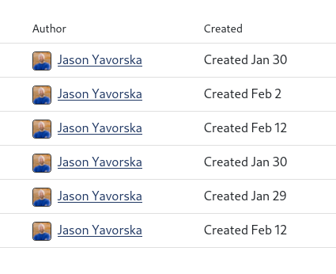

[Docs Home](index.md) | [Integrations](integrations.md) | [Markdown](markdown.md) | [Teams](teams.md) | [Topics](topics.md) | [User Settings](usersettings.md)

# User Settings

AsyncGo includes several user settings that you can use to configure how the app
looks for you.

## Notifications

If you are watching any topics then notifications will start to appear in your
notifications list whenever someone updates or comments in a topic you are
watching. Click on the notification bell at the top of any page and you can view
all the open notifications you have. From here you can also clear all
notifications.

You can watch any topic from the view topic page, by clicking on the button to
start watching.

## Fluid Mode

Fluid mode will expand the area for displaying content to fill up your whole
screen. You can use it if you prefer to see as much of the content on screen at
once as possible.

## Comment Order

You can choose between comments within a topic being sorted oldest to newest, or
newest to oldest depending on how you prefer to view them. The box to add a
comment will reposition to the top or bottom of the list, depending on your
preference.

## Avatar

AsyncGo shows your avatar from [Gravatar](https://www.gravatar.com). You can
update your picture there, and it will automatically be reflected here.

